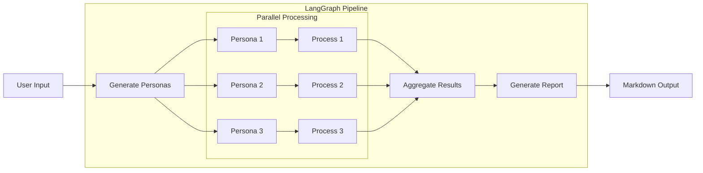

# AI Research Agents


A collection of LangGraph-powered AI agents that use persona-based analysis for user research and content evaluation. Built as a portfolio project demonstrating multi-agent architectures with OpenAI.

## Features

- **User Interview Agent**: Generates diverse personas and simulates interviews on any topic
- **SEO Search Intent Evaluation Agent**: Evaluates product descriptions using search intent personas
- **Translation Evaluation Agent**: Evaluates English→Japanese translations for naturalness
- **Sentence Evaluation Agent**: Evaluates marketing/business sentences with dynamic personas
- **Bilingual Support**: All agents support English and Japanese output (`--lang en/jp`)
- **Shared Architecture**: Reusable persona models across agents
- **Structured Reports**: Markdown output with optional PDF conversion

## Project Setup

1. **Clone the repository:**
   ```bash
   git clone https://github.com/your-username/ai-research-agents.git
   cd ai-research-agents
   ```

2. **Create and activate a Python virtual environment:**
   ```bash
   uv venv
   source .venv/bin/activate
   ```

3. **Install dependencies:**
   ```bash
   uv pip install -r requirements.txt
   ```

4. **Configure environment:**
   ```bash
   echo "OPENAI_API_KEY=your-api-key" > .env
   ```

## Usage

### User Interview Agent

Generates diverse personas and conducts simulated interviews on a given topic.

```bash
PYTHONPATH=script python script/run-user-interview.py --user-request "Your interview topic" --k 10
```

**Options:**
- `--user-request`: The interview topic (required)
- `--k`: Number of personas to generate (default: 10)
- `--lang`: Output language - `en` or `jp` (default: en)
- `--model-name`: OpenAI model to use (default: gpt-5-mini)

**Output:** `output/general-question/YYYYMMDD-<topic>.md`

### SEO Search Intent Evaluation Agent

Analyzes product descriptions against user search intent using 3 personas (informational, navigational, transactional).

```bash
# With inline content
PYTHONPATH=script python script/run-seo-search-intent-evaluation.py \
  --keyword "wireless headphones" \
  --content "Your product description here..."

# With content from file
PYTHONPATH=script python script/run-seo-search-intent-evaluation.py \
  --keyword "wireless headphones" \
  --content-file "product.txt"
```

**Options:**
- `--keyword`: Target keyword for SEO (required)
- `--content`: Product description text
- `--content-file`: Path to file containing product description
- `--lang`: Output language - `en` or `jp` (default: en)
- `--model-name`: OpenAI model to use

**Output:** `output/seo-evaluation/YYYYMMDD-eval-<keyword>.md`

**Report Structure:**
- Research Outline (keyword, content, method, overall score)
- Personas Generated (3 search intent types)
- Evaluation Dialogues (Q&A per persona)
- Scores Summary (Relevance, Clarity, Completeness, Persuasiveness)
- Recommendations

### Translation Evaluation Agent

Evaluates English→Japanese translations for naturalness using 3 reader-perspective personas (Business Professional, Young Adult, General Consumer).

```bash
# With inline text
PYTHONPATH=script python script/run-translation-evaluation.py \
  --source "Your English text" \
  --translation "日本語翻訳文"

# With files
PYTHONPATH=script python script/run-translation-evaluation.py \
  --source-file "english.txt" \
  --translation-file "japanese.txt"
```

**Options:**
- `--source`: Original English text
- `--source-file`: Path to file containing English text
- `--translation`: Japanese translation text
- `--translation-file`: Path to file containing Japanese translation
- `--lang`: Output language - `en` or `jp` (default: jp)
- `--model-name`: OpenAI model to use

**Output:** `output/translation/YYYYMMDD-translation-eval.md`

**Report Structure:**
- 評価概要 (Research Outline)
- 評価ペルソナ (3 reader personas)
- 評価詳細 (Issues with rewrite suggestions)
- スコアサマリー (Naturalness, Fluency, Tone, Clarity)
- 改善提案まとめ (Consolidated recommendations)

### Sentence Evaluation Agent

Evaluates marketing/business writing sentences using dynamically generated personas based on the provided context.

```bash
# With inline text
PYTHONPATH=script python script/run-sentence-evaluation.py \
  --background "Email subject line for B2B SaaS targeting startup CTOs" \
  --sentence "Unlock Your Team's Potential with AI"

# With background from file
PYTHONPATH=script python script/run-sentence-evaluation.py \
  --background-file "context.txt" \
  --sentence "Your sentence here"
```

**Options:**
- `--background`: Context for the sentence (required)
- `--background-file`: Path to file containing background context
- `--sentence`: The sentence to evaluate (required)
- `--lang`: Output language - `en` or `jp` (default: en)
- `--model-name`: OpenAI model to use

**Output:** `output/sentence-evaluation/YYYYMMDD-sentence-eval.md`

**Report Structure:**
- Evaluation Context (background, sentence, overall score)
- Generated Personas (dynamically created based on context)
- Evaluation Details (strengths, weaknesses per persona)
- Scores Summary (Clarity, Impact, Tone, Persuasiveness)
- Recommendations

### PDF Generation

Convert Markdown reports to PDF:

```bash
python script/convert_md_to_pdf.py output/<folder>/<report>.md
```

**Note:** Requires `GenShinGothic-Regular.ttf` and `GenShinGothic-Bold.ttf` in `font/` for Japanese character support.

## Project Structure

```
script/
├── shared/
│   ├── __init__.py              # Shared model and i18n exports
│   ├── persona_base.py          # Base Persona models
│   └── i18n.py                  # Bilingual translations (EN/JP)
├── run-user-interview.py        # User Interview Agent
├── run-seo-search-intent-evaluation.py  # SEO Search Intent Evaluation Agent
├── run-translation-evaluation.py # Translation Evaluation Agent
├── run-sentence-evaluation.py   # Sentence Evaluation Agent
└── convert_md_to_pdf.py         # PDF converter

output/
├── general-question/            # User Interview reports
├── seo-evaluation/              # SEO Search Intent Evaluation reports
├── translation/                 # Translation Evaluation reports
└── sentence-evaluation/         # Sentence Evaluation reports

examples/                        # Sample output reports
doc/                             # Project documentation
font/                            # Japanese fonts for PDF
```

## Architecture

All agents follow the same LangGraph StateGraph pattern:



The shared `Persona` base model enables consistent persona handling across agents while allowing specialized extensions:

| Agent | Persona Type | Special Fields |
|-------|--------------|----------------|
| User Interview | `Persona` | name, background |
| SEO Search Intent Evaluation | `SearchIntentPersona` | intent_type, search_query |
| Translation Evaluation | `TranslationPersona` | reader_type, age_range, reading_context |
| Sentence Evaluation | `SentencePersona` | perspective, evaluation_focus, relevance |

## Example Outputs

See the `examples/` folder for sample reports generated by each agent:

- [User Interview Example](examples/user-interview-example.md) - Morning routine for remote workers
- [SEO Search Intent Evaluation Example](examples/seo-evaluation-example.md) - Standing desk product description
- [Translation Evaluation Example](examples/translation-evaluation-example.md) - EN→JP translation with mistranslation detection
- [Sentence Evaluation Example](examples/sentence-evaluation-example.md) - Startup pitch deck opening

## Model Selection

The default model for all agents is `gpt-5-mini`, selected for its balance of high quality and reasonable cost.

### Comparison Results (January 2026)

We compared three models on the SEO Search Intent Evaluation task:

| Model | Quality | Cost/Run | Recommendation |
|-------|---------|----------|----------------|
| **gpt-5-mini** | Excellent (5/5) | $0.0029 | ⭐ Default - Best for high-stakes analysis |
| gemini-3-flash | Very Good (4/5) | $0.0036 | Good for high-volume processing |
| gpt-4.1-mini | Good (3/5) | $0.0018 | Good value for routine use |

### Why gpt-5-mini as Default?
- **Superior Quality**: Uses chain-of-thought reasoning for more nuanced and accurate analysis
- **Context Awareness**: Better understands subtle context in user intent and translation nuances
- **Reasonable Cost**: While slightly more expensive than 4.1-mini, the quality jump justifies the cost for professional use cases

### When to Use gpt-4.1-mini Instead
If you need to process a very large volume of data and cost is the primary concern, you can switch to `gpt-4.1-mini`.

Use `--model-name gpt-4.1-mini` for:
- High-volume batch processing
- Simple tasks not requiring deep reasoning
- Testing pipeline integrations

### Full Comparison Report
See [model-comparison/20260104-comparison-report.md](model-comparison/20260104-comparison-report.md) for detailed analysis.

## Configuration

| Variable | Description |
|----------|-------------|
| `OPENAI_API_KEY` | Required. OpenAI API key. Set in `.env` file |
| `GOOGLE_API_KEY` | Optional. Required for Gemini models. Set in `.env` file |

## Font Setup (for PDF Generation)

Download [GenShinGothic](https://github.com/nicro/genshingothic) fonts and place in `font/` directory:
- `GenShinGothic-Regular.ttf`
- `GenShinGothic-Bold.ttf`

## License

MIT
